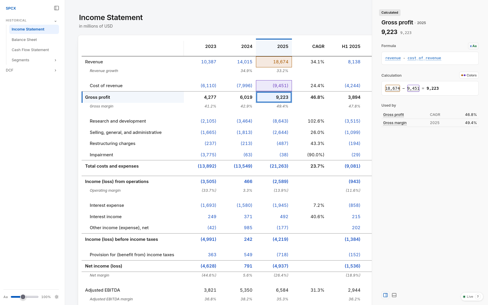

#  Libreta – AI spreadsheets you can audit

Spreadsheets in plain text: inputs in CSV, formulas in YAML, rendered as live tables you can click through.
Built for agents to write and humans to review.

**[See the SpaceX example →](https://danielochoa94.github.io/libreta/spacex/)**



- **Agents write it easily.** Plain CSV and YAML, with no `.xlsx` internals to parse.
- **Cheap on tokens.** Every change is a small text edit, not a Python script driving a spreadsheet library.
- **Formulas use variable names instead of cell addresses.** `gross_profit = revenue - cost_of_revenue`, not `=C14-C15`.
- **Every number is traceable.** Click a cell to see its formula, its inputs and a screenshot of where it came from.
- **Mistakes get caught.** Agents write checks, like tests for code: the balance sheet balances, line items sum to printed totals.
- **Changes are diffs.** A revised assumption is one line in a pull request.
- **Works with any agent in the terminal.** Claude Code, Codex, etc.; no vendor lock-in.
- **Free and yours to change.** Apache-2.0 and local; write your own formulas and formats, or fork the tool itself.

## How it works

A Libreta book is a folder of text files:

```text
facts/10-k.csv          figures copied from the source
formulas.yaml           everything calculated from them
checks.yaml             assertions, like the balance sheet balancing
view.yaml               what to show, in what order
```

The agent edits these files, and the page in your browser recalculates on every save, so you review the work as it lands.

Just as Markdown separates writing from formatting, Libreta does the same for spreadsheets.

## Install

On macOS or Linux, including WSL:

```bash
curl -fsSL https://raw.githubusercontent.com/danielochoa94/libreta/main/install.sh | sh
```

On Windows, in PowerShell:

```powershell
irm https://raw.githubusercontent.com/danielochoa94/libreta/main/install.ps1 | iex
```

The installer downloads the latest [release](https://github.com/danielochoa94/libreta/releases), which bundles everything Libreta needs, and puts `libreta` on `PATH`; rerun it to update.
It installs to `~/.local/lib/libreta`, linked from `~/.local/bin/libreta`, or on Windows to `%LOCALAPPDATA%\Programs\libreta`; delete those to uninstall.

To try the example, clone this repository and open it:

```bash
git clone https://github.com/danielochoa94/libreta.git
libreta libreta/books/spacex
```

The book opens in your browser, and the page recalculates as you save any of its files.

Releases also carry the archives by themselves.
A browser marks what it downloads, so the first launch of one meets a warning the installer avoids: on macOS, clear it with `xattr -dr com.apple.quarantine libreta`; on Windows, choose **More info**, then **Run anyway**.

### With a coding agent

Paste this into Claude Code or another coding agent, from the folder where you want your models to live:

```text
Install Libreta from https://github.com/danielochoa94/libreta by running its installer: on macOS or Linux,
`curl -fsSL https://raw.githubusercontent.com/danielochoa94/libreta/main/install.sh | sh`; on Windows,
`irm https://raw.githubusercontent.com/danielochoa94/libreta/main/install.ps1 | iex`.
Read `libreta --docs format` and `libreta --docs running`.
```

## Why not Excel or regular code

Excel is built for humans clicking cells.
An agent working on an `.xlsx` reads a zip of XML, where the math is buried under styles and column widths it pays for in tokens.
It can't see its own results without Excel or LibreOffice to calculate them, and `=C14-C15` says nothing about formula logic.

Having the agent write the model in Python fixes the math but buries it in code, where a reviewer can't easily trace it.
Libreta fixes the engine and the interface, so the agent only writes inputs and formulas, and humans only review and judge.

## What you get

For the agent, a CLI:

- `libreta --value` returns any cell's value, its formula, what it reads and what reads it, as JSON.
- `libreta --lines` returns many lines at once by qualified name, for a tool such as a slide deck quoting the book.
- `libreta --check` runs every check, such as subtotals matching the printed totals or the balance sheet balancing.

For you, a live page in the browser:

- It recalculates on every save, so you review the agent's edits as it makes them.
- Clicking a figure shows its formula with the values it read, and links to its input with optional screenshots of the original source.
- `libreta --export` writes the whole book to one HTML file that works offline, source images included, or to an Excel workbook with a sheet per view.

## A book in brief

A book is a folder with a `book.yaml`, and each table in it is a folder with a `view.yaml`:

```text
income-statement/
  facts/10-k.csv                                    figures copied from the source
  facts/10-k.yaml                                   source metadata
  facts/10-k.png                                    optional: source screenshot, for tracing figures
  formulas.yaml                                     all calculations from facts and derived figures
  checks.yaml                                       assertions, like the balance sheet balancing
  view.yaml                                         what to show, in what order
```

```csv
line_item,2023,2024,2025
revenue,10387,14015,18674
cost_of_revenue,6110,7996,9451
```

```yaml
# 10-k.yaml
source:
  url: https://www.sec.gov/...
  image: 10-k.png                # optional, as are image_regions
line_items:
  revenue:
    label: Revenue
    image_regions:
      2025: { x: 501, y: 104, width: 43, height: 19 }
  cost_of_revenue:
    label: Cost of revenue
    sign: contra
```

```yaml
# formulas.yaml
formulas:
  gross_profit:
    formula: revenue - cost_of_revenue
  gross_margin:
    formula: gross_profit / revenue
    units: percent
```

```yaml
# view.yaml
title: Income Statement
columns: [2023, 2024, 2025]
rows:
  - line: revenue
  - line: cost_of_revenue
  - line: gross_profit
    style: subtotal
  - line: gross_margin
```

`style` names what a row is, `subtotal`, `total` or `supplemental`, and Libreta decides how it looks; see [Presentation](docs/format.md#presentation).
Libreta has built-in formats for common units such as `percent` and `dollars`; a `formats.yaml` at or above a book adds or redefines units, see [Formats](docs/format.md#formats).

## Documentation

- [Book format](docs/format.md): facts, formulas, checks, views, signs, formats and composition.
- [Running Libreta](docs/running.md): the server, headless commands, checks and export.

Both are also built in: `libreta --docs format`, `libreta --docs running`.

These are more for agents to consume than for humans to learn.

## Changing Libreta

Clone the repository and install the [.NET 10 SDK](https://dot.net/download); on WSL, install the Linux SDK inside the distribution and never build with `dotnet.exe`, since it builds on the Windows side, where file locks, processes and ports are out of WSL's reach.
Run from source with `dotnet watch`, which reloads books, the interface and C# as you edit, where a plain `dotnet run` never reloads C#:

```bash
dotnet watch --project src/Libreta run -- books/spacex
```

`./scripts/install-from-source.sh` makes your build the `libreta` on `PATH`, and the installer puts a release back.
[AGENTS.md](AGENTS.md) holds the vocabulary and conventions, for people and coding agents alike.

## Status

Libreta is a personal project shared as-is.
I don't review issues or pull requests, but you are free to fork it and make it your own; see [CONTRIBUTING.md](CONTRIBUTING.md).

## License

[Apache-2.0](LICENSE).
Use it freely, commercially included.
If Libreta is useful to you or your business, a mention of [editide](https://editide.com) is appreciated.

The SpaceX book is built from public SEC filings; its valuation assumptions are illustrative and not investment advice.

## Authorship

Built by the team behind [editide](https://editide.com).
Our thesis is that agents work better on plain text than generating code for outdated file formats like OOXML.
Libreta applies that to spreadsheets.
